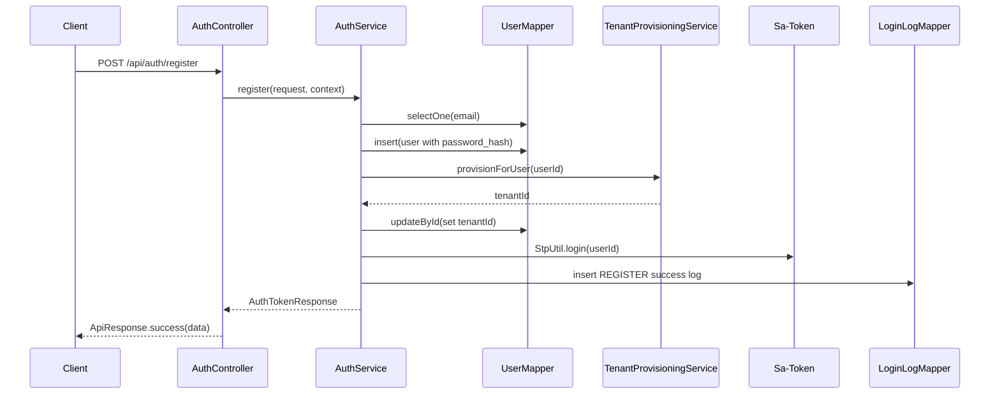

# Auth 模块设计与实现说明（基于当前项目代码）

## 1. 模块目标

Auth 模块负责账号生命周期与会话生命周期管理，覆盖以下能力：

- 注册：创建用户、初始化租户、自动登录
- 登录：校验身份、签发 token、记录登录日志
- 会话：查询当前登录会话信息
- 刷新令牌：延长会话有效期
- 登出：清理当前登录态
- 改密：校验旧密码后更新密码哈希

对应控制器入口为 `POST/GET /api/auth/**`，见 `src/main/java/com/jaycong/boot/modules/auth/controller/AuthController.java:27`。

## 2. 技术栈与基础能力

认证模块依赖以下关键组件：

- Sa-Token：会话登录态与权限注解框架（`pom.xml:46`，`application.yml:26`）
- Spring Validation：请求参数校验（`pom.xml:34` + DTO 注解）
- Spring Security Crypto（BCrypt）：密码哈希（`pom.xml:38`，`SecurityBeansConfig.java:12`）
- MyBatis-Plus：实体映射、逻辑删除与自动填充（`BaseEntity.java:20`、`MybatisPlusMetaObjectHandler.java:12`）

## 3. 代码结构与职责划分

### 3.1 控制层（AuthController）

`AuthController` 负责：

- 路由暴露（`/api/auth`）
- 入参校验（`@Valid` + DTO 约束）
- 提取请求上下文（IP、User-Agent）
- 调用服务层并统一返回 `ApiResponse`

关键代码：

- 控制器定义：`AuthController.java:26`
- 注册入口：`AuthController.java:42`
- 登录入口：`AuthController.java:52`
- 组装上下文：`AuthController.java:96`

### 3.2 服务层（AuthService）

`AuthService` 承载认证核心业务规则：

- 邮箱规范化（小写 + trim）
- 密码哈希与比对（`PasswordEncoder`）
- 登录态管理（`StpUtil.login/logout`）
- 登录日志写入（`login_logs`）
- 统一登录态校验（`ensureLogin`）

关键代码：

- 类定义：`AuthService.java:27`
- 注册事务：`AuthService.java:53`
- 登录事务（失败不回滚日志）：`AuthService.java:83`
- 登录态校验：`AuthService.java:180`

### 3.3 数据访问层（Mapper + Entity）

- 用户表映射：`UserEntity.java:12` -> `users`
- 登录日志映射：`LoginLogEntity.java:12` -> `login_logs`
- Mapper 继承 `BaseMapper`，复用 MyBatis-Plus CRUD：
  - `UserMapper.java:8`
  - `LoginLogMapper.java:8`

### 3.4 异常与返回约定

- 业务异常：`BusinessException`（`BusinessException.java:3`）
- 错误码：`ErrorCode`（`ErrorCode.java:3`）
- 统一响应：`ApiResponse`（`ApiResponse.java:3`）
- 全局异常映射：`GlobalExceptionHandler`（`GlobalExceptionHandler.java:21`）

这使认证接口始终返回统一结构：`{code, message, data}`。

## 4. 数据模型设计（认证相关）

数据库表定义见 `database/schema.sql`：

- `users`：账号主表（`schema.sql:2`）
  - 核心字段：`tenant_id/email/password_hash/status`
  - 唯一约束：`uk_users_email_deleted`（`schema.sql:15`）
- `login_logs`：登录审计表（`schema.sql:18`）
  - 记录成功/失败、IP、UA、失败原因
  - 索引：`idx_login_logs_user_time`（`schema.sql:33`）

实体继承 `BaseEntity`，自动维护审计字段与逻辑删除标记。

## 5. 核心流程讲解（结合代码案例）

## 5.1 案例一：用户注册（register）

入口：`POST /api/auth/register`（`AuthController.java:42`）

执行链路：

1. DTO 校验：邮箱格式、密码长度（`RegisterRequest.java:10`、`:16`）
2. 邮箱规范化：`normalizeEmail`（`AuthService.java:159`）
3. 冲突检测：按邮箱查询，已存在则抛 409（`AuthService.java:56`-`:59`）
4. 密码加密：`passwordEncoder.encode(...)`（`AuthService.java:63`）
5. 创建用户：`userMapper.insert(user)`（`AuthService.java:66`）
6. 初始化租户：`tenantProvisioningService.provisionForUser(userId)`（`AuthService.java:67`）
7. 回填用户租户：`user.setTenantId(...)` + `updateById`（`AuthService.java:68`-`:69`）
8. 登录签发 token：`StpUtil.login(user.getId())`（`AuthService.java:71`）
9. 写注册日志：`reason=REGISTER`（`AuthService.java:72`）
10. 返回 token + 用户视图（`AuthService.java:73`）

为什么要在注册时调用租户初始化？

- 因为系统是多租户模型，后续 RBAC/业务查询都依赖 `user.tenant_id`。
- 注册完成后即可拥有默认 OWNER 权限能力，避免“账号存在但无法访问业务”的空窗期。

对应租户初始化实现见 `TenantProvisioningService.java:44`，其中会：

- 创建默认租户（`TenantProvisioningService.java:46`-`:50`）
- 建立 user-tenant 关系（`TenantProvisioningService.java:55`-`:59`）
- 初始化 OWNER 角色与内置权限（`TenantProvisioningService.java:60`）

## 5.2 案例二：用户登录（login）

入口：`POST /api/auth/login`（`AuthController.java:52`）

执行链路：

1. 邮箱规范化 + 查询用户（`AuthService.java:85`-`:87`）
2. 用户不存在：写失败日志 `EMAIL_NOT_FOUND` + 抛 401（`AuthService.java:88`-`:90`）
3. 用户状态非 ACTIVE：写失败日志 + 抛 403（`AuthService.java:92`-`:95`）
4. 密码不匹配：写失败日志 `PASSWORD_MISMATCH` + 抛 401（`AuthService.java:97`-`:99`）
5. 登录成功：`StpUtil.login(userId)`（`AuthService.java:102`）
6. 记录成功日志 `LOGIN`（`AuthService.java:103`）
7. 返回 token 结构（`AuthService.java:104`）

关键设计点：

- `@Transactional(noRollbackFor = BusinessException.class)`（`AuthService.java:83`）
  - 登录失败属于业务失败而非系统错误；
  - 失败日志需要落库用于审计，因此不因业务异常回滚。

## 5.3 案例三：会话、刷新与改密

- 查询会话：`GET /api/auth/session` -> `ensureLogin` -> 返回 token 与用户信息（`AuthService.java:120`）
- 刷新令牌：`POST /api/auth/token/refresh` -> 重新 `StpUtil.login(loginId)`（`AuthService.java:136`-`:140`）
- 修改密码：`POST /api/auth/password/change`
  - 校验旧密码（`AuthService.java:152`-`:154`）
  - 写入新密码哈希（`AuthService.java:155`-`:156`）

## 6. 权限鉴权如何接入认证结果

项目把“认证（是否登录）”与“鉴权（是否有权限）”做了分层：

- 认证：由 `AuthService` 内的 `ensureLogin()` 等逻辑保证
- 鉴权：由 `@SaCheckPermission` 注解 + `StpInterface` 动态权限提供器保证

### 6.1 控制器鉴权注解

例如 Billing 与 RBAC 控制器使用：

- `@SaCheckPermission(...)`（`BillingController.java:44`、`RbacController.java:46`）

### 6.2 权限数据来源

Sa-Token 在鉴权时会回调 `RbacStpInterfaceImpl`：

- `getPermissionList`（`RbacStpInterfaceImpl.java:22`）
- `getRoleList`（`RbacStpInterfaceImpl.java:31`）

然后委托 `RbacService` 从“用户-角色-权限”关系中动态查询：

- 角色列表：`RbacService.java:217`
- 权限列表：`RbacService.java:246`

注册时初始化的 OWNER 角色与内置权限来自：

- `RbacService.bootstrapOwnerRole(...)`（`RbacService.java:285`）
- 内置权限目录：`RbacPermissionCatalog.java:19`

## 7. 异常处理与错误语义

认证相关错误最终都被 `GlobalExceptionHandler` 统一为 `ApiResponse.fail`：

- 业务异常：按 `BusinessException.code` 返回（`GlobalExceptionHandler.java:25`）
- 未登录：返回 401（`GlobalExceptionHandler.java:34`）
- 无权限：返回 403（`GlobalExceptionHandler.java:40`）
- 参数校验失败：返回 400（`GlobalExceptionHandler.java:46`）
- 未知异常：返回 500（`GlobalExceptionHandler.java:63`）

这保证了前端接入时有稳定的错误处理契约。

## 8. 认证主流程时序图

## 9. 当前实现特点与可演进点

当前实现优点：

- 认证主流程短链路、职责清晰，控制器薄、服务层聚焦业务
- 注册即完成租户与初始权限初始化，业务可用性高
- 登录成功/失败均有审计日志，便于排查与风控

可演进方向（不影响当前可用）：

- 增加登录风控（限流、验证码、失败阈值锁定）
- 完善 token 管理策略（单端/多端会话策略细化）
- 增加审计扩展字段（设备指纹、地域信息）

