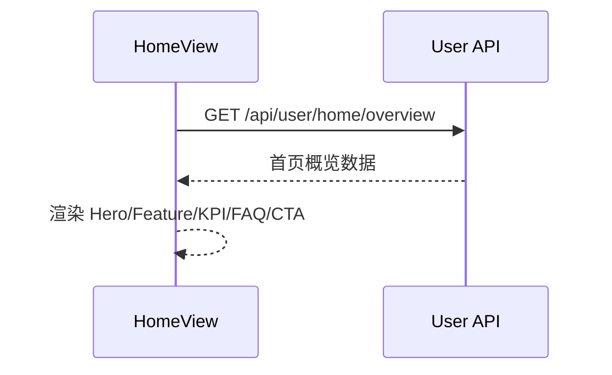

## 获取首页概览数据

**接口名称：** 获取首页概览数据  
**功能描述：** 返回 HomeView 渲染所需的 Hero、信任背书、核心价值、社证数据、FAQ、底部 CTA 数据。  
**接口地址：** `/api/user/home/overview`  
**请求方式：** `GET`

### 功能说明

用于首屏与主内容区一次性数据加载，降低页面首屏接口数量，减少重复请求。



### 请求参数

```json
{}
```

| 参数名 | 类型 | 必填 | 说明 | 示例值 |
| --- | --- | --- | --- | --- |
| 无 | - | - | 本接口无需参数 | - |

### 响应参数

```json
{
  "code": 200,
  "body": {
    "hero": {
      "eyebrow": "面向内容创业者的增长引擎",
      "title": "10 秒生成可发布文案",
      "description": "从选题、生成、迭代到交付...",
      "primaryActionText": "立即免费试用",
      "secondaryActionText": "查看真实案例"
    },
    "trustBadges": ["4.2 万创作者正在使用", "平均节省写作时间 68%"],
    "sectionTitles": {
      "features": "核心价值",
      "socialProof": "社证数据",
      "faq": "常见问题"
    },
    "featureCards": [],
    "kpiCards": [],
    "faqList": [],
    "finalCta": {
      "title": "准备好把创作效率变成盈利能力了吗？",
      "description": "现在注册即可开启试用，并获得首月订阅优惠。",
      "primaryActionText": "免费开始",
      "secondaryActionText": "查看套餐"
    },
    "updatedAt": "2026-04-09T06:30:00.000Z"
  },
  "message": "获取首页数据成功",
  "success": true
}
```

| 参数名 | 类型 | 必填 | 说明 | 示例值 |
| --- | --- | --- | --- | --- |
| code | number | 是 | 状态码，200 为成功 | 200 |
| body | object | 是 | 业务数据主体 | - |
| body.hero | object | 是 | 首屏文案与按钮文案 | - |
| body.trustBadges | string[] | 是 | 信任背书标签 | `["4.2 万创作者正在使用"]` |
| body.sectionTitles | object | 是 | 各区块标题文案 | - |
| body.featureCards | object[] | 是 | 核心价值卡片 | - |
| body.kpiCards | object[] | 是 | 社证 KPI 卡片 | - |
| body.faqList | object[] | 是 | FAQ 列表 | - |
| body.finalCta | object | 是 | 底部 CTA 文案 | - |
| body.updatedAt | string | 是 | 数据更新时间（ISO） | `2026-04-09T06:30:00.000Z` |
| message | string | 是 | 响应消息 | 获取首页数据成功 |
| success | boolean | 是 | 请求是否成功 | true |

---

## 获取首页案例列表

**接口名称：** 获取首页案例列表  
**功能描述：** 返回“查看真实案例”弹窗所需案例卡片。  
**接口地址：** `/api/user/home/cases`  
**请求方式：** `GET`

### 功能说明

用于首页案例弹窗按需加载，避免首屏加载过多非关键数据。

### 请求参数

```json
{
  "limit": 3
}
```

| 参数名 | 类型 | 必填 | 说明 | 示例值 |
| --- | --- | --- | --- | --- |
| limit | number | 否 | 返回案例条数，默认 3，最大 4 | 3 |

### 响应参数

```json
{
  "code": 200,
  "body": [
    {
      "id": "case_1",
      "title": "教育训练营：7 天起号专题",
      "industry": "教育培训",
      "gain": "单周咨询线索 +129%",
      "summary": "用多版本文案 + 结构化话题清单..."
    }
  ],
  "message": "获取案例列表成功",
  "success": true
}
```

| 参数名 | 类型 | 必填 | 说明 | 示例值 |
| --- | --- | --- | --- | --- |
| code | number | 是 | 状态码，200 为成功 | 200 |
| body | object[] | 是 | 案例列表 | - |
| body[].id | string | 是 | 案例 ID | case_1 |
| body[].title | string | 是 | 案例标题 | 教育训练营：7 天起号专题 |
| body[].industry | string | 是 | 行业标签 | 教育培训 |
| body[].gain | string | 是 | 收益数据摘要 | 单周咨询线索 +129% |
| body[].summary | string | 是 | 案例简介 | 用多版本文案 + 结构化话题清单... |
| message | string | 是 | 响应消息 | 获取案例列表成功 |
| success | boolean | 是 | 请求是否成功 | true |

---

## Mock 与真实接口切换

通过环境变量切换：

- `VITE_USER_API_MODE=mock`：走 `src/api/user/mockManager.ts`
- `VITE_USER_API_MODE=real`：走真实后端请求
- `VITE_USER_API_BASE_URL`：真实接口基础地址（例如 `http://127.0.0.1:8080`）
- `VITE_USER_MOCK_DELAY_MS`：Mock 延迟（毫秒）

示例：

```bash
VITE_USER_API_MODE=real
VITE_USER_API_BASE_URL=http://127.0.0.1:8080
VITE_USER_MOCK_DELAY_MS=180
```
