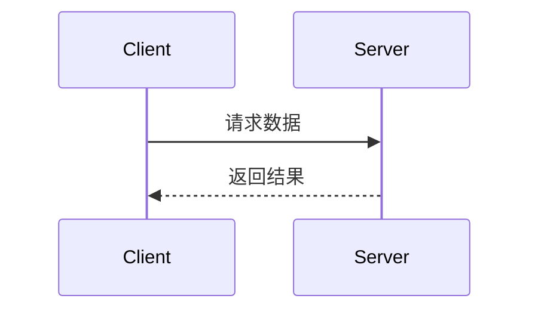

# 项目开发规范

## 🎯 技术栈约定
- **前端框架**: Vue 3 + Composition API
- **PC端UI组件库**: Ant Design Vue
- **开发语言**: TypeScript
- **状态管理**: Pinia
- **路由管理**: Vue Router
- **构建工具**: Vite
- **样式**: CSS3 + CSS Variables


## 📁 项目结构规范

### API模块组织

- API文件位置: [src/api/]
- 命名规范: `模块名称 + Api.js` (如 [UserApi.js]
- Mock数据统一管理: [mockManager.js]
- API入口文件: [index.js]

### 文档组织

- API文档位置: [docs/]
- 命名规范: `模块名称 + API.md` (如 [UserAPI.md]
- 项目文档: [README.md]

## 🔧 API开发规范

### 1. API接口文件结构

每个API文件必须包含完整的JSDoc注释：

```javascript
/**
 * 接口名称
 * 功能描述：详细描述接口的作用
 * 入参：{ param1: 类型, param2: 类型 }
 * 返回参数：返回数据结构说明
 * url地址：/api/endpoint
 * 请求方式：GET/POST
 */
export function apiFunction(params) {
  return get('/api/endpoint', params)
}
```

### 2. Mock数据规范

- 所有API接口都必须在 [mockManager.js] 中提供Mock实现
- Mock数据要真实、完整，符合实际业务场景
- 使用 `registerMockApi(method, url, handler)` 注册Mock接口
- 返回数据格式统一使用 `createSuccessResponse()` 和 `createErrorResponse()`

### 3. 请求方式限制

- **仅允许使用 GET 和 POST 两种请求方式**
- GET: 用于数据查询和获取
- POST: 用于数据创建、更新、删除

## 📖 API文档规范

### 文档同步要求

**当生成或修改API接口时，以下内容变更必须同步更新API文档：**

- 入参结构变更
- 返回参数变更  
- URL地址变更
- 请求方式变更

### 文档格式标准

#### 基本信息

```markdown
## 接口名称

**接口名称：** 简短描述接口功能
**功能描述：** 详细描述接口的业务用途
**接口地址：** /api/endpoint
**请求方式：** GET/POST
```

#### 功能说明

```markdown
### 功能说明
详细描述接口的业务逻辑，可以使用流程图或时序图：



#### 请求参数

```markdown
### 请求参数
```json
{
  "page": 1,
  "page_size": 10,
  "status": "active"
}
```

| 参数名    | 类型   | 必填 | 说明               | 示例值 |
| --------- | ------ | ---- | ------------------ | ------ |
| page      | int    | 否   | 页码（默认1）      | 2      |
| page_size | int    | 否   | 每页数量（默认10） | 20     |
| status    | string | 否   | 状态过滤           | active |

```
#### 响应参数
```markdown
### 响应参数
```json
{
  "code": 200,
  "body": {
    "user_id": 1,
    "username": "admin",
    "email": "admin@example.com",
    "status": "active"
  },
  "message": "获取用户基本信息成功",
  "success": true
}
```

| 参数名           | 类型   | 必填 | 说明   | 示例值               |
|---------------| ------ | ---- |------|-------------------|
| code          | int    | 是   | 状态码  | 200               |
| body          | object | 是   | 响应数据 |                   |
| body.user_id  | int    | 是   | 用户ID | 1                 |
| body.username | string | 是   | 用户名  | admin             |
| body.email    | string | 是   | 邮箱   | admin@example.com |
| body.status   | string | 是   | 用户状态 | active            |
| message       | string | 是   | 响应消息 | 获取用户基本信息成功        |
| success       | bool   | 是   | 是否成功 | true              |


## 项目结构

- api目录存放所有跟后端请求的服务API，任何涉及到后端调用的必须写在这个目录里面
- api的命名方式 模块名称大写API.js
- 每个接口必须有注释，注释格式如下：
```
 import { get, post, put, del } from './index.js'
  /**
  * 获取购物车列表
  * 功能描述：获取用户购物车中的所有商品
  * 入参：无
  * 返回参数：购物车商品列表
  * url地址：/cart/list
  * 请求方式：GET
  */
export function getCartList() {    
  return get('/cart/list')
}
```


## 🚫 开发限制

### 禁止事项
- 不允许在对话中使用 `npm run dev` 启动项目
- 不要在页面中定义测试数据，所有数据必须来自后端服务或Mock接口
- 不要创建测试文档
- 页面组件嵌套不要超过三层
